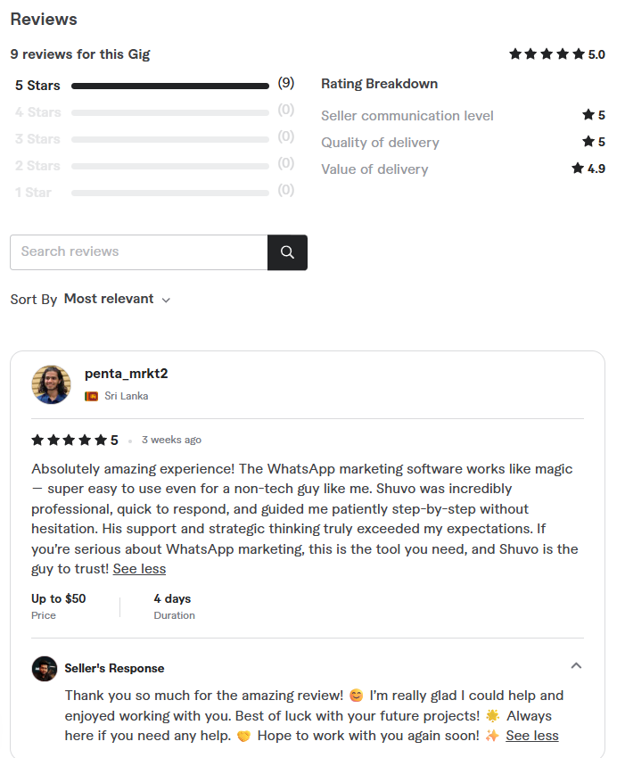

<!-- Highlighted Free Trial Section -->

  <h2 style="margin: 0; color: #007acc; font-weight: 700; font-size: 1.8rem;">🎉 <strong>Free Trial Available!</strong></h2>
  
Try WaSender completely free before you buy — No risk, just real results! 💼✨

<h2 style="font-size: 2rem; color: #004a99; margin-bottom: 15px;">🚀 WaSender v3.6.0 — Powerful WhatsApp Marketing Software</h2>

  WaSender is an advanced WhatsApp marketing solution built for businesses, digital marketers, and agencies aiming to send unlimited bulk messages using single or multiple WhatsApp accounts effortlessly.
    
  With smart automated group joining, lead extraction tools, and personalized messaging, WaSender streamlines and boosts your marketing campaigns — making your workflow efficient and highly productive.

<h3 style="color: #007acc; margin-top: 30px;">✨ Key Features</h3>
<ul style="font-size: 1.05rem; line-height: 1.5; color: #222;">
  <li>✅ Unlimited Bulk Messaging</li>
  <li>✅ Multi WhatsApp Account Support</li>
  <li>✅ Import Contacts from Excel (Saved/Unsaved)</li>
  <li>✅ Automated Group Joining & Lead Extraction</li>
  <li>✅ Personalized Message Sending</li>
  <li>✅ Lead Extraction from Google Maps & Social Media</li>
  <li>✅ Human-like Automation to Avoid WhatsApp Ban</li>
  <li>✅ Real-Time Campaign Reporting</li>
  <li>✅ License Key System for Resellers</li>
</ul>

<h3 style="color: #007acc; margin-top: 35px;">🖼️ Sneak Peek</h3>

Check out WaSender v3.6.0 in action below 👇

<h3 style="color: #007acc;">💼 Who Can Benefit?</h3>
<ul style="font-size: 1.05rem; color: #222;">
  <li>📢 Digital Marketers & Advertisers</li>
  <li>🛍️ E-commerce Sellers & Retailers</li>
  <li>🏢 Small & Medium Businesses</li>
  <li>👨‍🏫 Coaches, Trainers & Consultants</li>
  <li>🤝 Lead Generation Specialists & Agencies</li>
</ul>

<h3 style="color: #007acc; margin-top: 30px;">⚙️ How to Get Started</h3>
<ol style="font-size: 1.05rem; color: #222; line-height: 1.5;">
  <li>Download WaSender on your Windows 10 or 11 PC</li>
  <li>Import your contacts list via Excel</li>
  <li>Connect one or multiple WhatsApp accounts</li>
  <li>Create & customize your marketing messages</li>
  <li>Launch your campaign instantly and track results</li>
</ol>

<h3 style="color: #007acc; margin-top: 30px;">📌 Important Notes</h3>
<ul style="font-size: 1.05rem; color: #222;">
  <li>Please include country codes with numbers (e.g., 1415xxxxxxx for USA, not 415xxxxxxx)</li>
  <li>This software is compatible only with <strong>Windows 10 & 11</strong></li>
</ul>

<h3 style="color: #007acc; margin-top: 35px;">📥 Want the Full Version?</h3>

  To activate WaSender or get full access, contact me directly on WhatsApp: 
  <mark style="background-color: #00bfff; color: white; padding: 3px 10px; border-radius: 5px; font-weight: 700;">+8801765245872</mark>

  🌍 Trusted by International Clients! 
  ⭐ See real reviews and order confidently: 
  <a href="https://www.fiverr.com/s/VYZLokm" target="_blank" rel="noopener noreferrer" style="color: #0a66c2; font-weight: 700; text-decoration: none;">
    🔗 Visit My Fiverr Gig
  </a>

<!-- Fiverr Review Image linked to Fiverr gig -->

  

<h3 style="color: #007acc; margin-bottom: 15px;">📩 Stay Connected with Me</h3>

  

    <strong>Instagram:</strong> 
    <a href="https://www.instagram.com/engrshuvo74886/" target="_blank" rel="noopener noreferrer" style="color: #e1306c; font-weight: 600; text-decoration: none;">
      @engrshuvo74886
    </a>
  

 <!-- YouTube Channel Showcase -->
<h3 style="color: #007acc; margin-bottom: 15px;">📺 Check Out My YouTube Channel</h3>

<!-- YouTube Channel Screenshot Preview (Full-width Image) -->

  

<!-- YouTube Channel Link Button -->

  <a href="https://www.youtube.com/@engr_shuvo" target="_blank" rel="noopener noreferrer"
     style="display: inline-block; background-color: #FF0000; color: white; font-weight: 700; font-size: 1.2rem; padding: 12px 28px; border-radius: 30px; text-decoration: none; box-shadow: 0 6px 15px rgba(255,0,0,0.3); transition: background-color 0.3s ease;">
    ▶️ Visit My YouTube Channel: @engr_shuvo
  </a>

<h4 style="margin-top: 45px; font-weight: 600; color: #555;">🧑‍💻 Developed with dedication by Engr Shuvo Das</h4>
